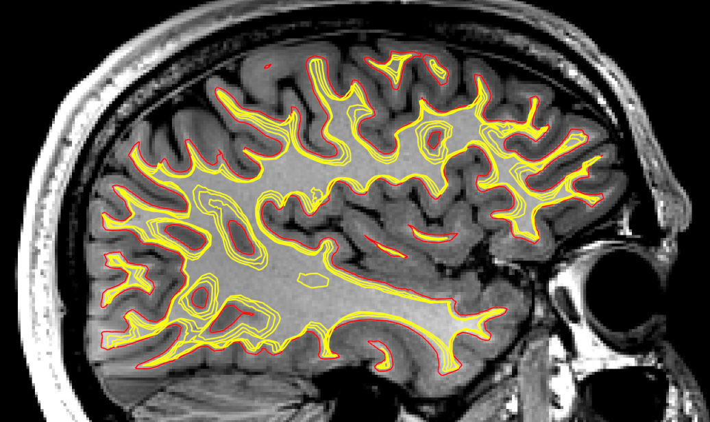

# superficial-White-Matter
Generates surfaces at various white matter depths (default 1, 2, and 3 voxels).
The depths are calculated based on the real world image resolution voxel size.

Red is the original wm surface, yellow are depths 1mm, 2mm, and 3mm

## Method
This is done by first computing a Laplace field over white matter (cortex to subcortex+ventricles), and then shifting an exiting white matter surface along that gradient.
Stopping conditions are set by geodesic distance travelled.

## Installation
```
git clone https://github.com/jordandekraker/superficial-white-matter.git
pip install superficial-white-matter/
```

## Usage with Freesurfer/Fastsurfer (example)
```bash
# This is the freesurfer/fastSurfer Subject directory
SUBJECTS_DIR=<path to surface subjects directory FreeSurfer/FastSurfer>

# Subject to process
SUBJECT=sub-01

# Output directory
OUT=<path to output directory>

# Convert segmentation to NIFTI
mri_convert ${SUBJECTS_DIR}/${SUBJECT}/mri/aparc+aseg.mgz ${OUT}/${SUBJECT}_aparc+aseg.nii.gz

# 1. Calculate the Laplace field
python sWM/laplace_solver.py \
  ${OUT}/${SUBJECT}_aparc+aseg.nii.gz \
  ${OUT}/${SUBJECT}_laplace-wm.nii.gz

# 2. Generate the surfaces for each hemisphere
for hemi in lh rh; do
  # White matter surface
  WM=${SUBJECTS_DIR}/${SUBJECT}/surf/${hemi}.white
  WM_gii=${OUT}/${SUBJECT}_hemi-${hemi}_label-white.surf.gii

  # Convert white matter to GIFTI
  mris_convert ${WM} ${WM_gii}

  # Calculate the SWM surfaces
  python sWM/surface_generator.py \
    "${WM_gii}" \
    ${OUT}/${SUBJECT}_laplace-wm.nii.gz \
    ${OUT}/${SUBJECT}_hemi-${hemi}_label-sWF_depth-
done

```


> If you ran `micapipe v0.2.0` or higher check the example script:  [`example_usage.sh`](./example_usage.sh)

## `laplace_solver.py`
```python
Solves Laplace equation over the domain of white matter.

Using grey matter as the source and ventricles as the sink.
Inputs are expected to be Free/FastSurfer aparc+aseg.mgz in .nii.gz format

Parameters
----------
NIFTI  :    str
            Parcellation file generated by Freesurfer/fastsurfre in nii.gz format (from mri/aparc+aseg.mgz).
NIFTI  :    str
            Output laplacian file path (nii.gz)

Returns
-------
NIFTI
    Laplacian image (nii.gz)

Usage
-----
laplace_solver.py aparc+aseg.nii.gz laplace-wm.nii.gz
```

## `surface_generator.py`
```python
Shifts a white matter surface inward along a Laplace field

Parameters
----------
GIFTI  :    str
            White matter surface in GIFTI format (surf.gii)
NIFTI  :    str
            laplacian image generated by laplace_solver.py
OUTPUT :    str
            path and name to the output surfaces
DEPTHS :    list [int | float] (OPTIONAL)
            DEFAULT=[1,2,3] List of depths to sample (in voxels)

Returns
-------
NIFTI
    a list of strings representing the header columns

Usage
-----
surface_generator.py hemi-L_label-white.surf.gii laplace-wm.nii.gz hemi-L_label-sWF_depth- 1,2,3
```

TODO:
- Optional medial wall mask
- normalize gradient magnitude to step size
